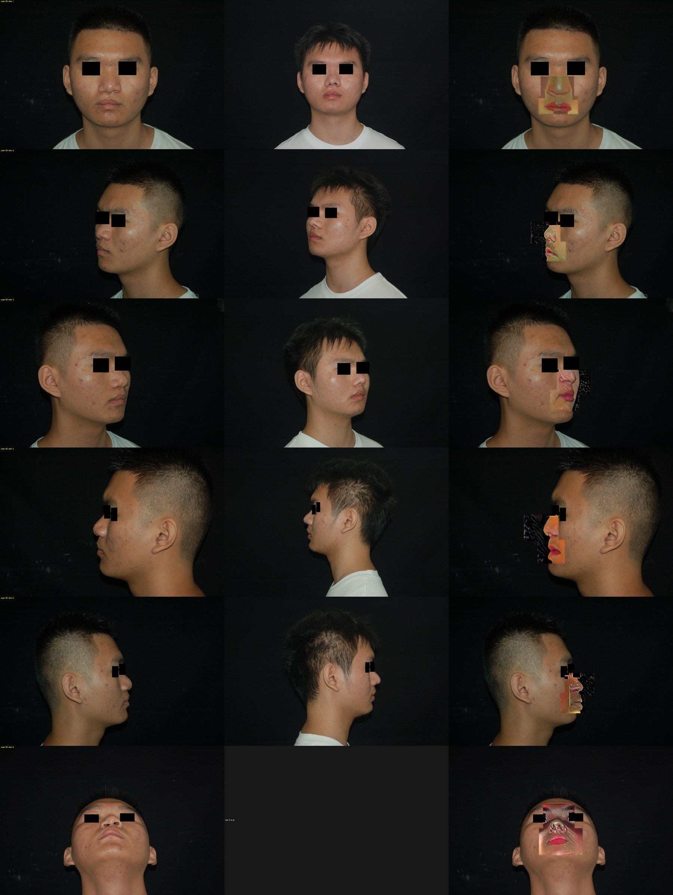
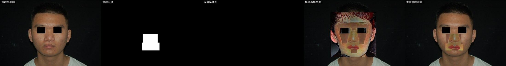
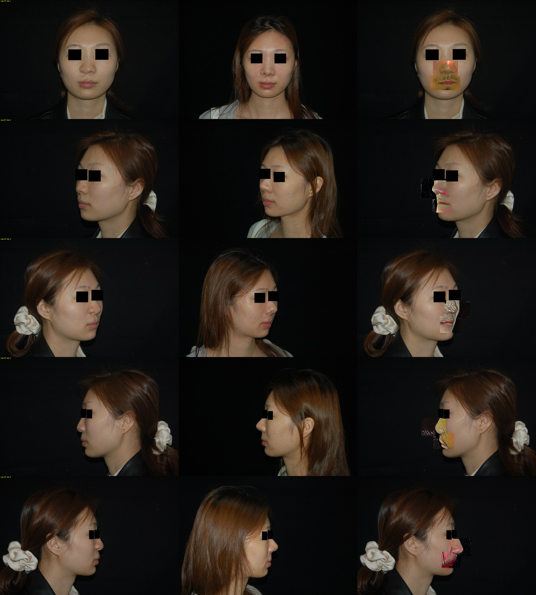
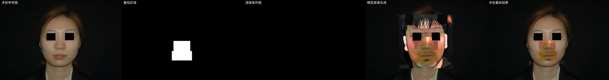

# 报告004：800-step LoRA 训练效果观察

日期：2026-07-05

## 1. 报告定位

这份报告只记录本轮 800-step SDXL inpainting LoRA 的实际效果，不把它写成方法成功报告。

本轮正式 LoRA 权重目录已经被删除，因此本报告基于以下证据：

1. 用户终端中的训练 summary。
2. `Feature_test` 已落盘推理结果。
3. `evaluate` 导出的 case sheet 和 triptych。
4. `infer` 导出的 preview，其中包含 raw inpaint 和最终 composite。

图片使用压缩版副本，保存于：

```text
REPORT/assets/report_004/
```

原始大图仍在：

```text
Image_output/generation/lora_pre2post_800step_feature_test/
```

## 2. 本轮训练与推理配置

训练 summary 关键信息：

```text
train_samples       = 898
sample_type         = pre_to_post_inpaint
max_train_steps     = 800
resolution          = 1024
rank / alpha        = 16 / 16
learning_rate       = 5e-5
mixed_precision     = bf16
mean_loss           = 0.16010754398885182
base_model_variant  = fp16
```

推理 summary 关键信息：

```text
requested_samples   = 27
success_count       = 27
failed_count        = 0
strength            = 0.88
guidance_scale      = 6.0
num_inference_steps = 20
torch_dtype         = bf16
```

实际落盘与评估结果：

```text
raw/composited/preview 实际各 20 张
evaluate inference_ok = 20
triptych_count        = 18
case_sheets           = 4
```

这里有一个工程记录问题：旧版 `infer.py` 当时没有检查 `cv2.imwrite()` 返回值，所以 summary 中的 `success_count=27` 高估了实际落盘数量。后续代码已经补了写图检查。

## 3. 整体效果结论

结论：本轮训练效果不可用。

它不是“术后形态还不够明显”，而是生成区域发生了明显失控：

1. 鼻嘴区域出现硬贴片。
2. 生成块内出现与当前人脸不一致的皮肤、嘴唇、鼻梁和阴影。
3. 多个视角有黑色背景块和矩形边界。
4. raw inpaint 已经坏，最终 composite 只是把坏结果贴回原图。
5. 轻量 identity 指标接近 1，但没有捕捉 mask 区域的灾难。

因此这轮不能作为可展示结果，也不建议继续在该权重上做长步数或大范围测试。

## 4. 图片证据一：case 50 整体对比

原始路径：

```text
Image_output/generation/lora_pre2post_800step_feature_test/eval/case_sheets/50.png
```

压缩版：



观察：

1. 正脸结果中，鼻嘴区域是明显矩形贴片，肤色和光照与原图不一致。
2. 侧脸结果中，重绘区域外侧带黑色背景块，边界非常硬。
3. 仰视角中，生成区域扩展成一整块面中纹理，已经不是单纯鼻子或嘴部微调。
4. 右列生成结果没有贴合左列术前身份，也没有稳定接近中列术后形态。

这说明模型没有学到“在当前术前脸上做术后鼻嘴变化”，而是在 mask 区域生成了一块语义上像脸部、但来源感很强的局部图。

## 5. 图片证据二：case 50 单张 preview

原始路径：

```text
Image_output/generation/lora_pre2post_800step_feature_test/infer/preview/50/术前/1.png
```

压缩版：



这张 preview 最关键，因为它把问题拆开了：

1. 第二列 mask 只标出鼻嘴区域。
2. 第四列 `模型直接生成` 已经出现完整脸部局部，包括额头、眼睛、头发和异常背景。
3. 第五列 `术前重绘结果` 只是把第四列坏块按 mask/composite 贴回术前图。

所以本轮问题不是后处理融合不好，而是 SDXL inpainting raw output 已经失控。

## 6. 图片证据三：case 97 整体对比

原始路径：

```text
Image_output/generation/lora_pre2post_800step_feature_test/eval/case_sheets/97.png
```

压缩版：



观察：

1. 正脸生成区域在鼻下和嘴部形成明显的局部换脸感。
2. 侧脸生成块中有黑色矩形背景和不属于原照片的纹理。
3. 多个视角下，鼻尖、鼻梁、上唇和下半脸的边界都不自然。
4. 术后参考图虽然有真实形态变化，但生成结果没有稳定学到这种变化，而是生成了独立贴片。

case 97 与 case 50 的失败形态一致，说明这不是单个样本异常，而是当前训练 recipe 的系统性问题。

## 7. 图片证据四：case 97 单张 preview

原始路径：

```text
Image_output/generation/lora_pre2post_800step_feature_test/infer/preview/97/术前/1.png
```

压缩版：



观察：

1. raw inpaint 区域没有被约束在自然鼻嘴重绘上。
2. 生成区域和原始脸部之间存在明显肤色、纹理和边界不连续。
3. composite 后仍然保留 raw output 的失控特征。

这再次支持同一个结论：当前权重并没有形成稳定的局部医学照片编辑能力。

## 8. 指标与肉眼效果的矛盾

评估 summary 中：

```text
hard_identity_similarity = 0.9999626189470291
soft_face_similarity     = 0.9987650066614151
```

这两个分数很高，但与图片效果冲突。原因是当前指标主要反映非编辑区或全脸轻量相似度，不能评价鼻嘴 mask 内部的真实质量。

本轮失败正好集中在 mask 区域，所以这些分数不能作为“效果还可以”的证据。后续验收必须把图片预览放在第一优先级，并增加 mask 区域质量指标，例如边界突变、肤色差异、局部纹理异常。

## 9. 对 rank 的判断

`rank=16` 的确可能偏小，但这轮效果不能简单归因于 rank 小。

如果只是 rank 小，更常见的失败应该是：

1. 术后变化弱。
2. 风格学不进去。
3. 输出接近底模，不够像训练集。

这轮实际看到的是：

1. 大块贴片。
2. 局部换脸。
3. 黑边和矩形背景。
4. raw output 生成了整块脸部纹理。

所以直接提高到 `rank=32/64` 不一定解决问题，反而可能让模型更强地记住错误映射。rank 调参应该放在训练/推理协议修正之后。

## 10. 当前阶段判断

本轮训练的正面价值是：

1. bf16 训练可以稳定跑完 800 step。
2. 898 个训练样本可以完整进入 LoRA 训练流程。
3. `Feature_test` 的 paired 对比能暴露真实视觉问题。
4. case sheet 和 preview 对诊断非常有效。

本轮训练的效果结论是：

```text
训练流程：跑通
数值稳定：基本通过
视觉效果：失败
是否可展示：不可展示
是否可继续扩步：不建议
是否先调 rank：不建议
```

## 11. 下一轮训练前必须改的点

下一轮应该先做小修复实验，而不是直接扩大训练：

1. 训练时把 condition 图在 mask 内挖空，和 SDXL inpainting 推理语义对齐。
2. 训练样本以术前 face crop 和术前 inpaint mask 为锚点，减少术前/术后坐标系错配。
3. 推理先测试 `strength=0.45 / 0.60 / 0.75`，不要继续默认 `0.88`。
4. mask 先从小区域开始，优先比较“只鼻子”和“鼻子+上唇过渡”，不要一开始鼻嘴整块重绘。
5. 只用 4 到 6 张固定 Feature_test 样本跑 smoke，视觉稳定后再全量跑。
6. 协议修好后再比较 `rank=16 / 32 / 64`。

## 12. 最终结论

本轮 800-step LoRA 的训练效果失败，失败形态非常明确：不是变化不足，而是局部 inpainting 失控。

它证明了当前工程流程能跑通，但也证明当前训练 recipe 不能直接用于“术前到术后鼻嘴重绘”。下一阶段应该优先修正 inpainting 条件输入、crop/mask 坐标系、mask 大小和推理 strength，然后再谈 rank、步数和更大训练。
